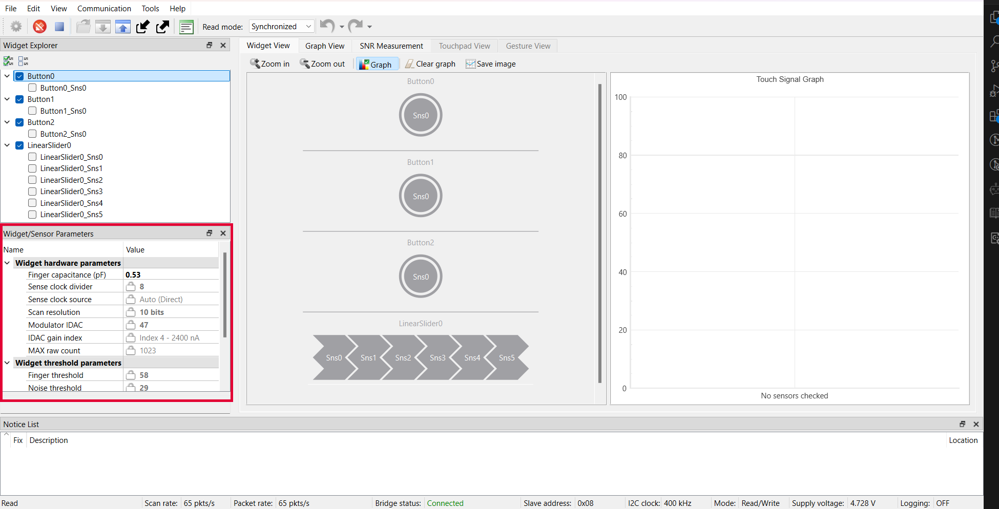
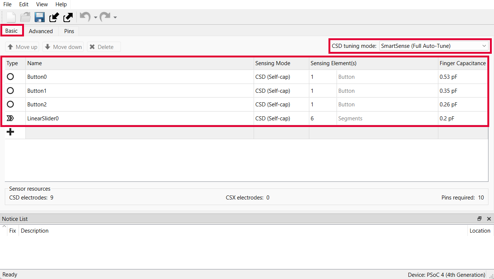
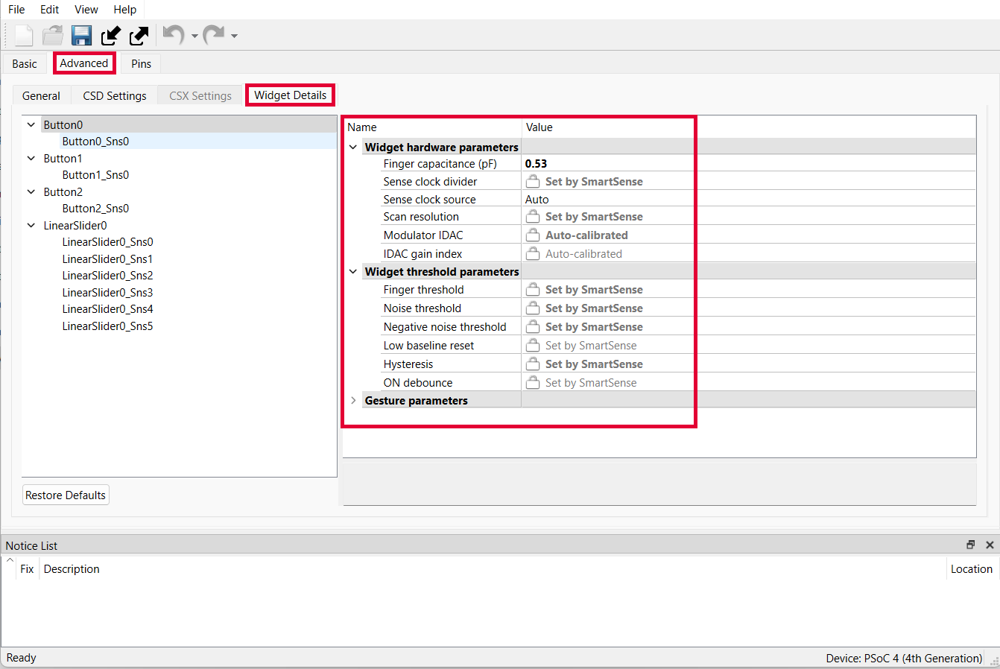
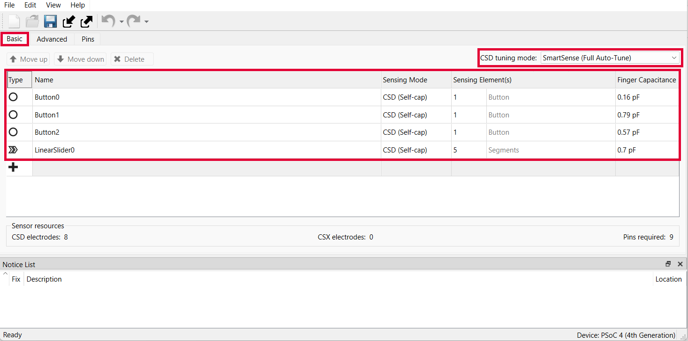
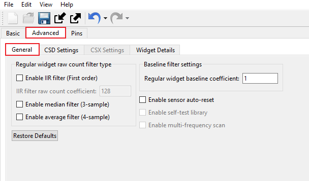
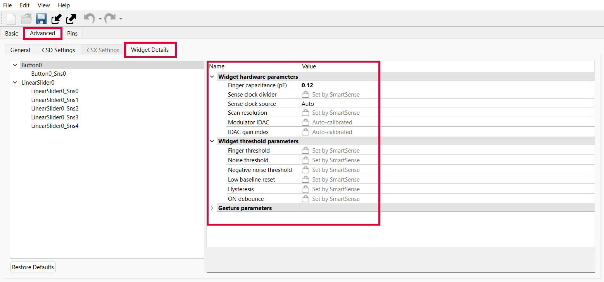
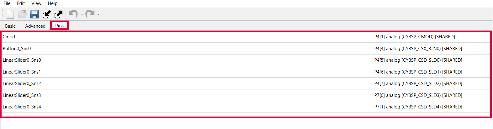

# PSOC&trade; 4: CAPSENSE&trade; SmartSense buttons slider

This code example demonstrates how to tune self-capacitance (CSD)-based buttons and slider widgets with SmartSense in PSOC&trade; 4 devices using the CAPSENSE&trade; tuner. It also demonstrates a breathing effect on the onboard user LED using the SmartIO and TCPWM (configured as PWM) components.

This document provides a high-level overview of the CSD widgets tuning flow and details on how to use the CAPSENSE&trade; tuner to monitor the CAPSENSE&trade; raw data and fine-tune the CSD buttons and slider for optimum performance.

[View this README on GitHub.](https://github.com/Infineon/mtb-example-psoc4-capsense-smartsense-buttons-slider)

[Provide feedback on this code example.](https://cypress.co1.qualtrics.com/jfe/form/SV_1NTns53sK2yiljn?Q_EED=eyJVbmlxdWUgRG9jIElkIjoiQ0UyMzc1MzIiLCJTcGVjIE51bWJlciI6IjAwMi0zNzUzMiIsIkRvYyBUaXRsZSI6IlBTT0MmdHJhZGU7IDQ6IENBUFNFTlNFJnRyYWRlOyBTbWFydFNlbnNlIGJ1dHRvbnMgc2xpZGVyIiwicmlkIjoicmFqYW5uYWdhdXRhIiwiRG9jIHZlcnNpb24iOiIyLjAuMCIsIkRvYyBMYW5ndWFnZSI6IkVuZ2xpc2giLCJEb2MgRGl2aXNpb24iOiJNQ0QiLCJEb2MgQlUiOiJJQ1ciLCJEb2MgRmFtaWx5IjoiUFNPQyJ9)


## Requirements

- [ModusToolbox&trade;](https://www.infineon.com/modustoolbox) v3.3 (tested with v3.3)
- Board support package (BSP) minimum required version: 3.1.0
- Programming language: C
- Associated parts: [PSOC&trade; 4000S, PSOC&trade; 4100S Plus, and PSOC&trade; 4500S](https://www.infineon.com/cms/en/product/microcontroller/32-bit-psoc-arm-cortex-microcontroller/psoc-4-32-bit-arm-cortex-m0-mcu/)


## Supported toolchains (make variable 'TOOLCHAIN')

- GNU Arm&reg; Embedded Compiler v11.3.1 (`GCC_ARM`) – Default value of `TOOLCHAIN`
- Arm&reg; Compiler v6.22 (`ARM`)
- IAR C/C++ Compiler v9.50.2 (`IAR`)


## Supported kits (make variable 'TARGET')

- [PSOC&trade; 4100S Plus Prototyping Kit](https://www.infineon.com/CY8CKIT-149) (`CY8CKIT-149`) - Default value of `TARGET`
- [PSOC&trade; 4000S CAPSENSE&trade; Prototyping Kit](https://www.infineon.com/CY8CKIT-145-40XX) (`CY8CKIT-145-40XX`)
- [PSOC&trade; 4500S Pioneer Kit](https://www.infineon.com/CY8CKIT-045S) (`CY8CKIT-045S`)


## Hardware setup

This example uses the board's default configuration. See the kit user guide to ensure that the board is configured correctly.

> **Note:** Some of the PSOC&trade; 4 kits ship with KitProg2 installed. The ModusToolbox&trade; requires KitProg3. Before using this code example, make sure that the board is upgraded to KitProg3. The tool and instructions are available in the [Firmware Loader](https://github.com/Infineon/Firmware-loader) GitHub repository. If you do not upgrade, you will see an error like "unable to find CMSIS-DAP device" or "KitProg firmware is out of date".


## Software setup

See the [ModusToolbox&trade; tools package installation guide](https://www.infineon.com/ModusToolboxInstallguide) for information about installing and configuring the tools package.

This example requires no additional software or tools.


## Using the code example


### Create the project

The ModusToolbox&trade; tools package provides the Project Creator as both a GUI tool and a command line tool.

<details><summary><b>Use Project Creator GUI</b></summary>

1. Open the Project Creator GUI tool.

   There are several ways to do this, including launching it from the dashboard or from inside the Eclipse IDE. For more details, see the [Project Creator user guide](https://www.infineon.com/ModusToolboxProjectCreator) (locally available at *{ModusToolbox&trade; install directory}/tools_{version}/project-creator/docs/project-creator.pdf*).

2. On the **Choose Board Support Package (BSP)** page, select a kit supported by this code example. See [Supported kits](#supported-kits-make-variable-target).

   > **Note:** To use this code example for a kit not listed here, you may need to update the source files. If the kit does not have the required resources, the application may not work.

3. On the **Select Application** page:

   a. Select the **Applications(s) Root Path** and the **Target IDE**.

   > **Note:** Depending on how you open the Project Creator tool, these fields may be pre-selected for you.

   b. Select this code example from the list by enabling its check box.

   > **Note:** You can narrow the list of displayed examples by typing in the filter box.

   c. (Optional) Change the suggested **New Application Name** and **New BSP Name**.

   d. Click **Create** to complete the application creation process.

</details>


<details><summary><b>Use Project Creator CLI</b></summary>

The 'project-creator-cli' tool can be used to create applications from a CLI terminal or from within batch files or shell scripts. This tool is available in the *{ModusToolbox&trade; install directory}/tools_{version}/project-creator/* directory.

Use a CLI terminal to invoke the 'project-creator-cli' tool. On Windows, use the command-line 'modus-shell' program provided in the ModusToolbox&trade; installation instead of a standard Windows command-line application. This shell provides access to all ModusToolbox&trade; tools. You can access it by typing "modus-shell" in the search box in the Windows menu. In Linux and macOS, you can use any terminal application.

The following example clones the "mtb-example-psoc4-capsense-smartsense-buttons-slider" application with the desired name "CapsenseSmartsenseButtonsSlider" configured for the [CY8CKIT-149](https://www.infineon.com/CY8CKIT-149) BSP into the specified working directory, C:/mtb_projects:

   ```
   project-creator-cli --board-id CY8CKIT-149 --app-id mtb-example-psoc4-capsense-smartsense-buttons-slider --user-app-name CapsenseSmartsenseButtonsSlider --target-dir "C:/mtb_projects"
   ```


The 'project-creator-cli' tool has the following arguments:

Argument | Description | Required/optional
---------|-------------|-----------
`--board-id` | Defined in the <id> field of the [BSP](https://github.com/Infineon?q=bsp-manifest&type=&language=&sort=) manifest | Required
`--app-id`   | Defined in the <id> field of the [CE](https://github.com/Infineon?q=ce-manifest&type=&language=&sort=) manifest | Required
`--target-dir`| Specify the directory in which the application is to be created if you prefer not to use the default current working directory | Optional
`--user-app-name`| Specify the name of the application if you prefer to have a name other than the example's default name | Optional
<br>

> **Note:** The project-creator-cli tool uses the `git clone` and `make getlibs` commands to fetch the repository and import the required libraries. For details, see the "Project creator tools" section of the [ModusToolbox&trade; tools package user guide](https://www.infineon.com/ModusToolboxUserGuide) (locally available at {ModusToolbox&trade; install directory}/docs_{version}/mtb_user_guide.pdf).

</details>


### Open the project

After the project has been created, you can open it in your preferred development environment.


<details><summary><b>Eclipse IDE</b></summary>

If you opened the Project Creator tool from the included Eclipse IDE, the project will open in Eclipse automatically.

For more details, see the [Eclipse IDE for ModusToolbox&trade; user guide](https://www.infineon.com/MTBEclipseIDEUserGuide) (locally available at *{ModusToolbox&trade; install directory}/docs_{version}/mt_ide_user_guide.pdf*).

</details>


<details><summary><b>Visual Studio (VS) Code</b></summary>

Launch VS Code manually, and then open the generated *{project-name}.code-workspace* file located in the project directory.

For more details, see the [Visual Studio Code for ModusToolbox&trade; user guide](https://www.infineon.com/MTBVSCodeUserGuide) (locally available at *{ModusToolbox&trade; install directory}/docs_{version}/mt_vscode_user_guide.pdf*).

</details>


<details><summary><b>Keil µVision</b></summary>

Double-click the generated *{project-name}.cprj* file to launch the Keil µVision IDE.

For more details, see the [Keil µVision for ModusToolbox&trade; user guide](https://www.infineon.com/MTBuVisionUserGuide) (locally available at *{ModusToolbox&trade; install directory}/docs_{version}/mt_uvision_user_guide.pdf*).

</details>


<details><summary><b>IAR Embedded Workbench</b></summary>

Open IAR Embedded Workbench manually, and create a new project. Then select the generated *{project-name}.ipcf* file located in the project directory.

For more details, see the [IAR Embedded Workbench for ModusToolbox&trade; user guide](https://www.infineon.com/MTBIARUserGuide) (locally available at *{ModusToolbox&trade; install directory}/docs_{version}/mt_iar_user_guide.pdf*).

</details>

<details><summary><b>Command line</b></summary>

If you prefer to use the CLI, open the appropriate terminal, and navigate to the project directory. On Windows, use the command-line 'modus-shell' program; on Linux and macOS, you can use any terminal application. From there, you can run various `make` commands.

For more details, see the [ModusToolbox&trade; tools package user guide](https://www.infineon.com/ModusToolboxUserGuide) (locally available at *{ModusToolbox&trade; install directory}/docs_{version}/mtb_user_guide.pdf*).

</details>


## Operation

1. Connect the board to your PC using the provided micro-USB cable through the KitProg3 USB connector.

2. Program the board using one of the following:

   <details><summary><b>Using Eclipse IDE</b></summary>

      1. Select the application project in the Project Explorer.

      2. In the **Quick Panel**, scroll down, and click **\<Application Name> Program (KitProg3_MiniProg4)**.
   </details>


   <details><summary><b>In other IDEs</b></summary>

   Follow the instructions in your preferred IDE.
   </details>


   <details><summary><b>Using CLI</b></summary>

     From the terminal, execute the `make program` command to build and program the application using the default toolchain to the default target. The default toolchain is specified in the application's Makefile but you can override this value manually:
      ```
      make program TOOLCHAIN=<toolchain>
      ```

      Example:
      ```
      make program TOOLCHAIN=GCC_ARM
      ```
   </details>

3. After programming, the application starts automatically. The response to the CAPSENSE&trade; touch on the slider or button can be seen on its corresponding LED.

4. Observe the breathing effect on the onboard user LED (LED1) on the CY8CKIT-149 and CY8CKIT-145-40XX.

5. Launch the CAPSENSE&trade; tuner to monitor the CAPSENSE&trade; data and for CAPSENSE&trade; parameter tuning, and SNR measurement.

   See the [CAPSENSE&trade; Tuner guide](https://www.infineon.com/ModusToolboxCapSenseTuner) for step-by-step instructions on how to launch and configure the CAPSENSE&trade; Tuner in the ModusToolbox&trade;.

6. Go to **Tools** > **Tuner Communication Setup** and set the parameters as shown in **Figure 1**. Click **OK**.

   **Figure 1. Tuner Communication Setup**

   

7. Click **Connect**.

   **Figure 2. CAPSENSE&trade; tuner window**

   

8. Click **Start**.

   **Figure 3. CAPSENSE&trade; tuner start**

   

   The **Widget/Sensor Parameters** tab gets updated with the parameters configured in the **CAPSENSE&trade; Configurator** window.

   **Figure 4. CAPSENSE&trade; tuner window**

   

9. Observe the **Widget/Sensor Parameters** section in the CAPSENSE&trade; tuner window.

10. Touch the CAPSENSE&trade; buttons and slide your finger over the CAPSENSE&trade; linear slider. Observe the status signal change to 0 to 1 and the LEDs turn ON up to the relative position of touch.

## Debugging

You can debug the example to step through the code.


<details><summary><b>In Eclipse IDE</b></summary>

Use the **\<Application Name> Debug (KitProg3_MiniProg4)** configuration in the **Quick Panel**. For details, see the "Program and debug" section in the [Eclipse IDE for ModusToolbox&trade; user guide](https://www.infineon.com/MTBEclipseIDEUserGuide).

</details>


<details><summary><b>In other IDEs</b></summary>

Follow the instructions in your preferred IDE.

</details>


## Design and implementation

The project uses the [CAPSENSE&trade; middleware](https://github.com/Infineon/capsense) (see ModusToolbox&trade; user guide for more details on selecting the middleware). See [AN85951 – PSOC&trade; 4 and PSOC&trade; 6 MCU CAPSENSE&trade; design guide](https://www.infineon.com/AN85951) for more details on CAPSENSE&trade; features and usage.

The design has a CSD-based, three buttons, CAPSENSE&trade; slider, and EZI2C peripheral. The EZI2C slave peripheral is used to monitor the sensor data of buttons, slider and slider touch position information on a PC using the CAPSENSE&trade; tuner available in the Eclipse IDE for ModusToolbox&trade; via I2C communication. When the CAPSENSE&trade; linear slider is touched, depending on the touch position, the corresponding LEDs are turned ON. In the case of CAPSENSE&trade; buttons, if a touch is detected, corresponding LEDs are turned ON as shown in **Table 1**.

**Table 1. LEDs state depending on the CAPSENSE&trade; button/slider touch**

 Sensor             | CY8CKIT-149   | CY8CKIT-145-40XX  | CY8CKIT-045S
 :-------           | :------------ | :-----------      | :----------
 BUTTON0_SNS0       | LED11         | LED9              | RGB_RED
 BUTTON1_SNS0       | LED12         | LED10             | -
 BUTTON2_SNS0       | LED13         | LED11             | -
 LINEARSLIDER0_SNS0 | LED5          | LED4              | RGB_BLUE
 LINEARSLIDER0_SNS1 | LED6          | LED5              | RGB_BLUE
 LINEARSLIDER0_SNS2 | LED7          | LED6              | RGB_BLUE
 LINEARSLIDER0_SNS3 | LED8          | LED7              | RGB_BLUE
 LINEARSLIDER0_SNS4 | LED9          | LED8              | RGB_BLUE
 LINEARSLIDER0_SNS5 | LED10         | -                 | -
<br>

The code scans the widgets using the CSD sensing method and sends the CAPSENSE&trade; raw data over an I2C interface to the CAPSENSE&trade; tuner GUI tool on a PC using the on-board KitProg USB-I2C bridge.

The following steps explain the tuning procedure. Because the project already has the necessary settings by default, you can skip this procedure and go to [Operation](#operation) to verify the operation. To understand the tuning process and follow the steps for this kit or your own board, see [Tuning procedure](#tuning-procedure).

> **Note:** For more details on SmartSense, see the "SmartSense full auto-tune" section in the [PSOC&trade; 4 and PSOC&trade; 6 MCU CAPSENSE&trade; design guide](https://www.infineon.com/AN85951).


### Tuning procedure

SmartSense is a CAPSENSE&trade; tuning method that automatically sets sensing parameters for optimal performance based on user-specified Finger capacitance (pF) values and continuously compensates for system, manufacturing, and environmental changes.
In SmartSense Full Auto-tune mode, the only parameter that needs to be tuned by the user is the Finger capacitance (pF) parameter. The Finger capacitance (pF) parameter indicates the minimum value of Finger capacitance (pF) that should be detected as a valid touch by the CAPSENSE&trade; widget.

> **Note:** Even for the SmartSense auto-tuning, the CAPSENSE&trade; allows manual configuration of some general parameters like enabling and disabling of compensation IDAC, filters, shield such as liquid-tolerance related parameters and modulator clock. These can be left at their default values for most cases or configured based on the requirements.


####  Tuning button widgets

**Figure 5. CSD button widgets tuning flow**


Do the following to tune the slider:

<details><summary><b>Stage 1: Select the highest Finger capacitance (pF) value</b></summary>

1. Connect to CAPSENSE&trade; tuner by following the steps in the [Testing the basic operation](#testing-the-basic-operation) section.

2. Select the **Button0**, **Button1**, and **Button2** checkboxes and select **Synchronized** under **Read mode** and then navigate to **Graph View** as shown in **Figure 6**.

   The **Graph View** shows the raw counts and baseline for **Button0**, **Button1**, and **Button2** in the **Sensor data** window. Ensure that the **Raw counts** and **Baseline** checkboxes are selected to view the sensor data.

   **Figure 6. CAPSENSE&trade; tuner graph view**

   

3. In the **Widget hardware parameters** section, select **Finger capacitance (pF)** value as '1' (highest Finger capacitance (pF)) and click on **Apply to device** symbol to apply the changes to the device as shown in **Figure 7**.

   **Figure 7. CAPSENSE&trade; Widget hardware parameters**

   

   > **Note:** The valid range of **Finger capacitance (pF)** is 0.1 to 1.

</details>

<details><summary><b>Stage 2: Coarse tuning</b></summary>

1. Measure the signal and calculate the SNR.

   1. Switch to the **SNR Measurement** tab for measuring the SNR and to verify that the SNR is above 5:1, select **Button0** and **Button0_Sns0** sensor, and then click **Acquire Noise** as shown in **Figure 8**.

      **Figure 8. CAPSENSE&trade; tuner - SNR measurement: acquire noise**

      

   2. Once the noise is acquired, place the finger at a position on the button and then click **Acquire Signal**. Ensure that the finger remains on the button as long as the signal acquisition is in progress. Observe that the SNR is above 5:1.

      The calculated SNR on this button is displayed, as shown in **Figure 9**. Based on your end system design, test the signal with a finger that matches the size of your normal use case. Typically, the finger size targets are ~ 8 to 9 mm. Consider testing with smaller sizes that should be rejected by the system to ensure that they do not reach the finger threshold.

      **Figure 9. CAPSENSE&trade; tuner - SNR measurement: acquire signal**

      

2. Is SNR > 5:1 and does sensor status change to '1' on touch?

     1. Switch to the **Graph View** tab to verify the status change. Place the finger at a position on the button and see the status graph.

        Observe there is no change in the status signal for Finger capacitance (pF) value '1' as shown in **Figure 10**.

        **Figure 10. CAPSENSE&trade; tuner - status signal**

        

     2. For Finger capacitance (pF) value '1', SNR > 5:1 but the status signal is '0' on touch.

3. Choose the next lower value of Finger capacitance (pF).

    1. If the Finger capacitance (pF) value does not satisfy the both conditions (SNR > 5:1 & sensor status change to '1' on touch), choose the next lower value of Finger capacitance (pF).

    2. Repeat step 1 and step 2 in coarse-tuning process and verify both the conditions.

    3. Repeat step 3 until both conditions are satisfied.

       For this case, both conditions are satisfied for the Finger capacitance (pF) value 0.50, as shown in **Figure 11** and **Figure 12**.

        **Figure 11. CAPSENSE&trade; tuner - Status signal**

        

       **Figure 12. CAPSENSE&trade; tuner - SNR measurement**

        

    > **Note:** Coarse-tuning satisfies the requirements of most designs, but fine-tuning allows you to choose the most efficient CAPSENSE&trade; parameters (i.e., minimum sensor scan time) using the SmartSense.

</details>

<details><summary><b>Stage 3: Fine tuning</b></summary>

1. Choose the next higher value of Finger capacitance (pF).

   The next higher value of Finger capacitance (pF) is '0.60'. Change the Finger capacitance (pF) value to 0.50 to 0.60 and click on **Apply to device**, as shown in **Figure 9**.

      **Figure 9. CAPSENSE&trade; Apply to device button**

      

2. Measure the signal and calculate the SNR.

   1. Follow the same procedure explained in coarse-tuning step 1 to measure the SNR.

3. If the SNR > 5:1 and does the sensor status change to '1' on touch?

   1. Follow the same procedure explained in coarse tuning step 2 and verify the conditions.

4. Choose the Finger capacitance (pF) value.

   1. If the Finger capacitance (pF) value does not satisfy the conditions in step 3, skip to step 5.

   2. If the Finger capacitance (pF) value satisfy the conditions in step 3, choose that Finger capacitance (pF) value.

5. Decrease the Finger capacitance (pF) to a value in between the current and the next lower available value.

   The next lowest value between 0.60 and 0.50 is '0.59'. Change the Finger capacitance (pF) value to 0.59 and click on **Apply to device** button as shown in **Figure 9**.

6. Repeat the step 2, step 3, and step 4 for optimal Finger capacitance (pF) value.

   After following the steps the optimal value of Finger capacitance (pF) for **Button0** is '0.53'.

Repeat the entire tuning process for **Button1** and **Button2**.

> **Note:** For [CY8CKIT-045S](https://www.infineon.com/CY8CKIT-045S), only one button (Button0) is present.

</details>

> **Note:** The following tuning steps are done on [CY8CKIT-149](https://www.infineon.com/CY8CKIT-149). Follow the same tuning procedure for [CY8CKIT-145-40XX](https://www.infineon.com/CY8CKIT-145-40XX) and [CY8CKIT-045S](https://www.infineon.com/CY8CKIT-045S) kits.

The optimal Finger capacitance (pF) values after tuning is:

 Widget  |  [CY8CKIT-149](https://www.infineon.com/CY8CKIT-149) | [CY8CKIT-145-40XX](https://www.infineon.com/CY8CKIT-145-40XX) | [CY8CKIT-045S](https://www.infineon.com/CY8CKIT-045S)
 :------- | :------------    | :-----------  | :----------
 Button0 | 0.53 | 0.16 | 0.12
 Button1 | 0.35 | 0.79 | -
 Button2 | 0.26 | 0.57 | -
<br>


#### Tuning slider widgets


**Figure 13. CSD slider widget tuning flow**


> **Note:**

\* To review the slider design, see the **Slider design** section in the **Design considerations** chapter in the [PSOC&trade; 4 and PSOC&trade; 6 MCU CAPSENSE&trade; design guide](https://www.infineon.com/AN85951).

\** To do manual tuning, see the **Manual tuning** section in the **CAPSENSE&trade; performance tuning** chapter in the [PSOC&trade; 4 and PSOC&trade; 6 MCU CAPSENSE&trade; design guide](https://www.infineon.com/AN85951).

Do the following to tune the slider:

<details><summary><b>Stage 1: Set the Finger capacitance (pF) value to the maximum allowed</b></summary>

1. Connect to CAPSENSE&trade; tuner by following the steps in  [Testing the basic operation](#testing-the-basic-operation) section.

2. Select the **LinearSlider0** checkbox and select **Synchronized** under **Read mode**, and then navigate to **Graph View** as shown in **Figure 14**.

   The **Graph View** shows the raw counts and baseline for **LinearSlider0** in the **Sensor data** window. Ensure that the **Raw counts** and **Baseline** checkboxes are selected to view the sensor data.

   **Figure 14. CAPSENSE&trade; tuner graph view**

   

3. In the **Widget hardware parameters** section select **Finger capacitance (pF)** value as '1' (highest Finger capacitance (pF)) and Click on **Apply to device** symbol to apply the changes to the device as shown in **Figure 15**.

   **Figure 15. CAPSENSE&trade; Widget hardware parameters**

   

   > **Note:** The valid range of **Finger capacitance (pF)** is 0.1 to '1'.

</details>

<details><summary><b>Stage 2: Slide finger over the slider and monitor the difference count i.e., Sensor Signal</b></summary>

   Observe the **Sensor Signal** in **Graph View** section (see **Figure 16**) while sliding the finger. There is no change in the Sensor Signal for Finger capacitance (pF) value '1'.

   **Figure 16. CAPSENSE&trade; Sensor Signal**

   

</details>

<details><summary><b>Stage 3: At any finger position, do at least two slider segments provide difference count (Sensor Signal > 0)?</b></summary>

At any finger position, if at least two slider segments provides Sensor Signal > 0 , **Skip** to stage 4. If not, continue the process.

1. Is Finger capacitance (pF) >= minimum allowed Finger capacitance (pF) value?

   The minimum allowed Finger capacitance (pF) value is '0.1'. Check the given Finger capacitance (pF) value is >= 0.1.

   If the value is less than 0.1, **End the tuning process**.

   A hardware change may be required. Review slider design* or use manual tuning**.

   If the value is not less than 0.1, continue the process.


2. Decrease Finger capacitance (pF) value by one unit.

   1. Decrease the **Finger capacitance (pF)** value by one unit in **Widget hardware parameters** section and click on **Apply to device** symbol to apply the changes to the device as shown in **Figure 17**.

      **Figure 17. CAPSENSE&trade; Graph view**

      

   2. Repeat the process from **Stage 2**.

</details>

<details><summary><b>Stage 4: At any finger position, at least one slider segment provides an SNR > 5:1 and sensor signal > 50?</b></summary>

1. Measure the signal, calculate the SNR and verify SNR > 5:1.

   1. Switch to the **SNR Measurement** tab for measuring the SNR and to verify that the SNR is above 5:1, select **LinearSlider0**, **LinearSlider0_Sns0** sensor, and then click **Acquire Noise** as shown in **Figure 18**.

      **Figure 18. CAPSENSE&trade; tuner - SNR measurement: acquire noise**

      

   2. Once the noise is acquired, place the finger at a position on the selected Linear Slider sensor and then click **Acquire Signal**. Ensure that the finger remains on the Linear Slider sensor as long as the signal acquisition is in progress and observe the SNR.

      The calculated SNR on this LinearSlider0 is displayed, as shown in **Figure 19**. Based on your end system design, test the signal with a finger that matches the size of your normal use case. Typically, finger size targets are ~8 to 9 mm. Consider testing with smaller sizes that should be rejected by the system to ensure that they do not reach the finger threshold.

      **Figure 19. CAPSENSE&trade; tuner - SNR measurement: acquire signal**

      

2.  Verify sensor signal > 50?

     1. Switch to the **Graph View** tab to verify the sensor signal. Place the finger at a position on the LinearSlider sensor and see the status graph.

        Observe there is no change in the sensor signal for Finger capacitance (pF) value is 0.9, as shown in **Figure 20**.

        **Figure 20. CAPSENSE&trade; tuner - Status signal**

        

3. Repeat step 1 and step 2 for LinearSlider0_Sns1, LinearSlider0_Sns2, LinearSlider0_Sns3, LinearSlider0_Sns4 and LinearSlider0_Sns5.

   > **Note:** For [CY8CKIT-145-40XX](https://www.infineon.com/CY8CKIT-145-40XX) and [CY8CKIT-045S](https://www.infineon.com/CY8CKIT-045S) kits, only five slider segments present (LinearSlider0_Sns0, LinearSlider0_Sns1, LinearSlider0_Sns2, LinearSlider0_Sns3, and LinearSlider0_Sns4).

4. If at any finger position, at least one slider segment provides an SNR > 5:1 and sensor signal > 50 choose that Finger capacitance (pF).

   By following the above process at Finger capacitance (pF) value is 0.2, satisfies both the conditions as shown in the **Figure 21** and **Figure 22**

    **Figure 21. CAPSENSE&trade; tuner - LinearSlider Sensor signal**

    

    **Figure 22. CAPSENSE&trade; tuner - LinearSlider SNR measurement**

    

5. If both conditions did not satisfy, **Skip** to stage 3. Repeat the process from stage 3.

</details>

> **Note:** The following tuning steps are done on [CY8CKIT-149](https://www.infineon.com/CY8CKIT-149). Follow the same tuning procedure for [CY8CKIT-145-40XX](https://www.infineon.com/CY8CKIT-145-40XX) and [CY8CKIT-045S](https://www.infineon.com/CY8CKIT-045S) kits.

The optimal Finger capacitance (pF) values after tuning is:

 Widget | [CY8CKIT-149](https://www.infineon.com/CY8CKIT-149) | [CY8CKIT-145-40XX](https://www.infineon.com/CY8CKIT-145-40XX) | [CY8CKIT-045S](https://www.infineon.com/CY8CKIT-045S)
:--------|:-------------|:------------------|:-------------------
 LinearSlider0 | 0.2 | 0.7 | 0.48
<br>


####  Breathing effect of LED

In this code example, an user LED (LED1) is used to demonstrate the breathing effect. As shown in **Figure 23**, the breathing effect is generated by XORing two PWM signals that have slightly different frequencies with a duty cycle of 50 percent. The XOR gate is implemented using the SmartIO Component. The SmartIO Component is configured in a combinatorial mode with the look-up table (LUT) configured for an XOR gate implementation. The two PWMs are of 100 Hz and 101.01 Hz frequency. Routing these PWM signals through an exclusive-OR (XOR) gate yields an output signal with a gradually changing duty cycle. Driving an LED with this signal results in a “breathing” effect, where the LED gradually gets brighter or dimmer. The rate of change is proportional to the difference between the PWM output frequencies.

This breathing LED part of the code example is performed entirely in hardware. Firmware is not required to do anything for the breathing effect to work.

   **Figure 23. LED Breathing Effect by XORing Two PWM Signals**

   

   > **Note:** This breathing effect is implemented only for the CY8CKIT-149 and CY8CKIT-145-40XX kits, as the CY8CKIT-045S has only a single RGB LED.


### Resources and settings


#### [CY8CKIT-149](https://www.infineon.com/CY8CKIT-149)
1. Connect the board to your PC using the provided USB cable through the KitProg3 USB connector.

2. Launch the CAPSENSE&trade; configurator tool.

   The CAPSENSE&trade; configurator tool can be launched in Eclipse IDE for ModusToolbox&trade; from the 'CSD peripheral' setting in the device configurator or in stand-alone mode directly from the Project Explorer.

   See the [ModusToolbox&trade; CAPSENSE&trade; configurator tool guide](https://www.infineon.com/ModusToolboxCapSenseConfig) for step-by-step instructions on how to configure and launch CAPSENSE&trade; in the ModusToolbox&trade;.

3. In the **Basic** tab, a single slider **LinearSlider0** and three buttons (**Button0**, **Button1** and **Button2**) are configured as a **CSD (Self-cap)**, and the CSD tuning mode is configured as **SmartSense (Full Auto-Tune)**.

   **Figure 24. CAPSENSE&trade; configurator - Basic tab**

   

4. Do the following in the **General** sub-tab under the **Advanced** tab:

   **Figure 25. CAPSENSE&trade; configurator - General sub-tab in Advanced Tab**

   

5. Go to the **CSD Settings** tab and make the following changes:

   - Select **Enable compensation IDAC**.

      **Figure 26. CAPSENSE&trade; configurator - CSD settings sub-tab in Advanced Tab**

      

6. Go to the **Widget Details** tab. Set all the parameters with SmartSense.

   **Figure 27. CAPSENSE&trade; configurator - widget details in Advanced tab**

   

7. Go to the **Pins** tab. Connect the pins as shown in **Figure 28**.

     **Figure 28. CAPSENSE&trade; configurator - Pins Tab**

      

8. Click **Save** to apply the settings.


#### [CY8CKIT-145-40XX](https://www.infineon.com/CY8CKIT-145-40XX)
1. Connect the board to your PC using the provided USB cable through the KitProg3 USB connector.

2. Launch the CAPSENSE&trade; configurator tool.

   The CAPSENSE&trade; configurator tool can be launched in Eclipse IDE for ModusToolbox&trade; from the 'CSD peripheral' setting in the device configurator or in stand-alone mode directly from the Project Explorer.

   See the [ModusToolbox&trade; CAPSENSE&trade; configurator tool guide](https://www.infineon.com/ModusToolboxCapSenseConfig) for step-by-step instructions on how to configure and launch CAPSENSE&trade; in the ModusToolbox&trade;.

3. In the **Basic** tab, a single slider **LinearSlider0** and three buttons (**Button0**, **Button1**, and **Button2**) are configured as a **CSD (Self-cap)**, and the CSD tuning mode is configured as **SmartSense (Full Auto-Tune)**.

   **Figure 29. CAPSENSE&trade; configurator - basic tab**

   

4. Do the following in the **General** sub-tab under the **Advanced** tab:

   **Figure 30. CAPSENSE&trade; configurator - general sub-tab in Advanced Tab**

   

5. Go to the **CSD Settings** tab and make the following changes:

   - Select **Enable compensation IDAC**.

      **Figure 31. CAPSENSE&trade; configurator - CSD settings sub-tab in Advanced Tab**

      

6. Go to the **Widget Details** tab. Set all the parameters with SmartSense.


   **Figure 32. CAPSENSE&trade; configurator - widget details in Advanced tab**

   

7. Go to the **Pins** tab. Connect the pins as shown in **Figure 33**.

     **Figure 33. CAPSENSE&trade; configurator - Pins tab**

      

8. Click **Save** to apply the settings.


### [CY8CKIT-045S](https://www.infineon.com/CY8CKIT-045S)
1. Connect the board to your PC using the provided USB cable through the KitProg3 USB connector.

2. Launch the CAPSENSE&trade; configurator tool.

   The CAPSENSE&trade; configurator tool can be launched in Eclipse IDE for ModusToolbox&trade; from the 'CSD peripheral' setting in the device configurator or in stand-alone mode directly from the Project Explorer.

   See the [ModusToolbox&trade; CAPSENSE&trade; configurator tool guide](https://www.infineon.com/ModusToolboxCapSenseConfig) for step-by-step instructions on how to configure and launch CAPSENSE&trade; in the ModusToolbox&trade;.

3. In the **Basic** tab, a single slider **LinearSlider0** and a button **Button0** are configured as a **CSD (Self-cap)**, and the CSD tuning mode is configured as **SmartSense (Full Auto-Tune)**.

   **Figure 34. CAPSENSE&trade; configurator - Basic tab**

   

4. Do the following in the **General** sub-tab under the **Advanced** tab:

   **Figure 35. CAPSENSE&trade; configurator - General sub-tab in Advanced tab**

   

5. Go to the **CSD Settings** tab and make the following changes:

   - Select **Enable compensation IDAC**.

      **Figure 36. CAPSENSE&trade; configurator - CSD settings sub-tab in Advanced tab**

      

6. Go to the **Widget Details** tab. Set all the parameters with SmartSense.

   **Figure 37. CAPSENSE&trade; configurator - widget details in Advanced tab**

   

7. Go to the **Pins** tab. Connect the pins as shown in **Figure 38**.

     **Figure 38. CAPSENSE&trade; configurator - Pins tab**

      

8. Click **Save** to apply the settings.

 **Figure 39. Device configurator - EZI2C peripheral**

 

**Table 2. Application resources**
 Resource  |  Alias/object     |    Purpose
 :-------- | :-------------    | :------------
 SCB (I2C) (PDL) | CYBSP_EZI2C | EZI2C slave driver to communicate with the CAPSENSE&trade; tuner
 TCPWM (PWM) (PDL) | CYBSP_PWM1 | Generate a PWM signal with 50% duty cycle
 TCPWM (PWM) (PDL) | CYBSP_PWM2 | Generate a PWM signal with 50% duty cycle
 SMART I/O 1 (PDL) | SMART_IO | Implements XOR gate using the PWM signal generated from the CYBSP_PWM1 and CYBSP_PWM2
 CAPSENSE&trade; | CYBSP_CapSense | CAPSENSE&trade; driver to interact with the CSD hardware and interface CAPSENSE&trade; sensors


### Firmware flow

**Figure 40. Firmware flowchart**

 

<br>


## Related resources

Resources  | Links
-----------|----------------------------------
Application notes  | [AN79953](https://www.infineon.com/AN79953) – Getting started with PSOC&trade; 4
Code examples  | [Using ModusToolbox&trade;](https://github.com/Infineon/Code-Examples-for-ModusToolbox-Software) on GitHub <br> [Using PSOC&trade; Creator](https://www.infineon.com/cms/en/design-support/software/code-examples/psoc-3-4-5-code-examples-for-psoc-creator/)
Device documentation | [PSOC&trade; 4 datasheets](https://www.infineon.com/cms/en/search.html#!view=downloads&term=psoc4&doc_group=Data%20Sheet) <br>[PSOC&trade; 4 technical reference manuals](https://www.infineon.com/cms/en/search.html#!view=downloads&term=psoc4&doc_group=Additional%20Technical%20Information)
Development kits | Select your kits from the [Evaluation board finder](https://www.infineon.com/cms/en/design-support/finder-selection-tools/product-finder/evaluation-board).
Libraries on GitHub | [mtb-pdl-cat2](https://github.com/Infineon/mtb-pdl-cat2) – PSOC&trade; 4 Peripheral Driver Library (PDL)<br> [mtb-hal-cat2](https://github.com/Infineon/mtb-hal-cat2) – Hardware Abstraction Layer (HAL) library
Middleware on GitHub | [capsense](https://github.com/Infineon/capsense) – CAPSENSE&trade; library and documents <br>
Tools  | [ModusToolbox&trade;](https://www.infineon.com/modustoolbox) – ModusToolbox&trade; software is a collection of easy-to-use software and tools enabling rapid development with Infineon MCUs, covering applications from embedded sense and control to wireless and cloud-connected systems using AIROC&trade; Wi-Fi and Bluetooth® connectivity devices.
<br>


## Other resources

Infineon provides a wealth of data at [www.infineon.com](https://www.infineon.com) to help you select the right device, and quickly and effectively integrate it into your design.


## Document history

Document title: *CE237532* - *PSOC&trade; 4: CAPSENSE&trade; SmartSense buttons slider*

 Version | Description of change
 ------- | ---------------------
 1.0.0   |  New code example
 1.1.0   |  Added support for CY8CKIT-045S
 2.0.0   |  Added LED output for all the supported kits <br> Added Smart I/O for CY8CKIT-149 and CY8CKIT-145-40XX
<br>


All referenced product or service names and trademarks are the property of their respective owners.

The Bluetooth&reg; word mark and logos are registered trademarks owned by Bluetooth SIG, Inc., and any use of such marks by Infineon is under license.


---------------------------------------------------------

© Cypress Semiconductor Corporation, 2023-2024. This document is the property of Cypress Semiconductor Corporation, an Infineon Technologies company, and its affiliates ("Cypress").  This document, including any software or firmware included or referenced in this document ("Software"), is owned by Cypress under the intellectual property laws and treaties of the United States and other countries worldwide.  Cypress reserves all rights under such laws and treaties and does not, except as specifically stated in this paragraph, grant any license under its patents, copyrights, trademarks, or other intellectual property rights.  If the Software is not accompanied by a license agreement and you do not otherwise have a written agreement with Cypress governing the use of the Software, then Cypress hereby grants you a personal, non-exclusive, nontransferable license (without the right to sublicense) (1) under its copyright rights in the Software (a) for Software provided in source code form, to modify and reproduce the Software solely for use with Cypress hardware products, only internally within your organization, and (b) to distribute the Software in binary code form externally to end users (either directly or indirectly through resellers and distributors), solely for use on Cypress hardware product units, and (2) under those claims of Cypress's patents that are infringed by the Software (as provided by Cypress, unmodified) to make, use, distribute, and import the Software solely for use with Cypress hardware products.  Any other use, reproduction, modification, translation, or compilation of the Software is prohibited.
<br>
TO THE EXTENT PERMITTED BY APPLICABLE LAW, CYPRESS MAKES NO WARRANTY OF ANY KIND, EXPRESS OR IMPLIED, WITH REGARD TO THIS DOCUMENT OR ANY SOFTWARE OR ACCOMPANYING HARDWARE, INCLUDING, BUT NOT LIMITED TO, THE IMPLIED WARRANTIES OF MERCHANTABILITY AND FITNESS FOR A PARTICULAR PURPOSE.  No computing device can be absolutely secure.  Therefore, despite security measures implemented in Cypress hardware or software products, Cypress shall have no liability arising out of any security breach, such as unauthorized access to or use of a Cypress product. CYPRESS DOES NOT REPRESENT, WARRANT, OR GUARANTEE THAT CYPRESS PRODUCTS, OR SYSTEMS CREATED USING CYPRESS PRODUCTS, WILL BE FREE FROM CORRUPTION, ATTACK, VIRUSES, INTERFERENCE, HACKING, DATA LOSS OR THEFT, OR OTHER SECURITY INTRUSION (collectively, "Security Breach").  Cypress disclaims any liability relating to any Security Breach, and you shall and hereby do release Cypress from any claim, damage, or other liability arising from any Security Breach.  In addition, the products described in these materials may contain design defects or errors known as errata which may cause the product to deviate from published specifications. To the extent permitted by applicable law, Cypress reserves the right to make changes to this document without further notice. Cypress does not assume any liability arising out of the application or use of any product or circuit described in this document. Any information provided in this document, including any sample design information or programming code, is provided only for reference purposes.  It is the responsibility of the user of this document to properly design, program, and test the functionality and safety of any application made of this information and any resulting product.  "High-Risk Device" means any device or system whose failure could cause personal injury, death, or property damage.  Examples of High-Risk Devices are weapons, nuclear installations, surgical implants, and other medical devices.  "Critical Component" means any component of a High-Risk Device whose failure to perform can be reasonably expected to cause, directly or indirectly, the failure of the High-Risk Device, or to affect its safety or effectiveness.  Cypress is not liable, in whole or in part, and you shall and hereby do release Cypress from any claim, damage, or other liability arising from any use of a Cypress product as a Critical Component in a High-Risk Device. You shall indemnify and hold Cypress, including its affiliates, and its directors, officers, employees, agents, distributors, and assigns harmless from and against all claims, costs, damages, and expenses, arising out of any claim, including claims for product liability, personal injury or death, or property damage arising from any use of a Cypress product as a Critical Component in a High-Risk Device. Cypress products are not intended or authorized for use as a Critical Component in any High-Risk Device except to the limited extent that (i) Cypress's published data sheet for the product explicitly states Cypress has qualified the product for use in a specific High-Risk Device, or (ii) Cypress has given you advance written authorization to use the product as a Critical Component in the specific High-Risk Device and you have signed a separate indemnification agreement.
<br>
Cypress, the Cypress logo, and combinations thereof, ModusToolbox, PSoC, CAPSENSE, EZ-USB, F-RAM, and TRAVEO are trademarks or registered trademarks of Cypress or a subsidiary of Cypress in the United States or in other countries. For a more complete list of Cypress trademarks, visit www.infineon.com. Other names and brands may be claimed as property of their respective owners.
